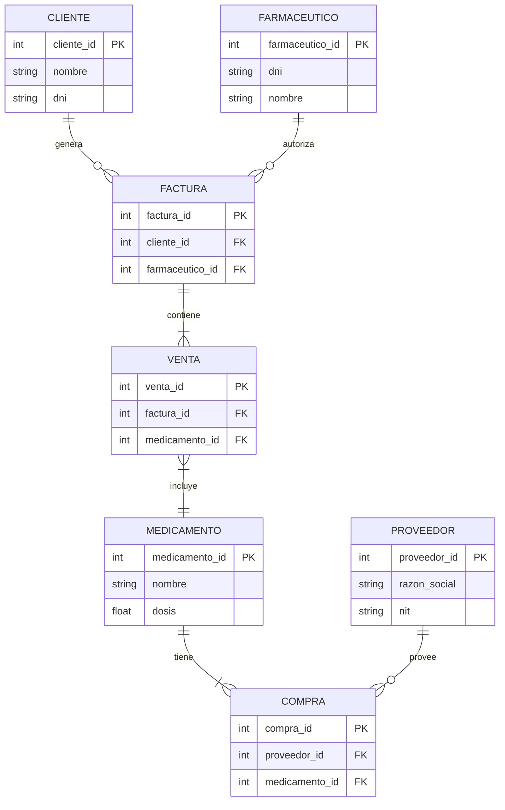
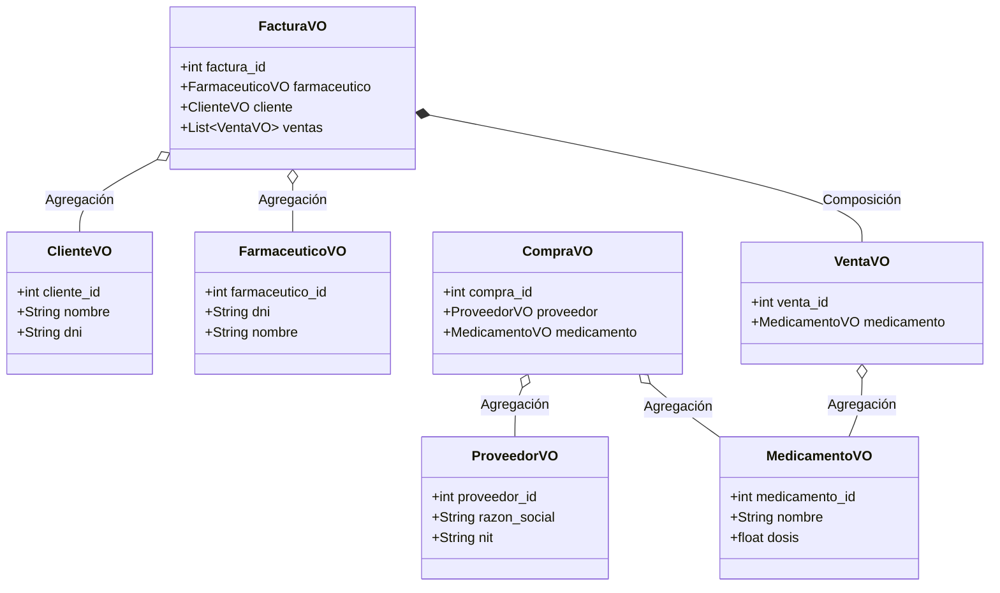

# Documentación de Diseño y Arquitectura

Esta documentación cumple con los requisitos establecidos para la entrega, proporcionando los diagramas solicitados y detallando la estrategia de carga (Eager vs Lazy Loading).

## 1. Patrón Arquitectónico

La aplicación sigue las capas especificadas:
- **Vista (UI)**: Implementada en `PyQt5` (`ui/`). Interfaz amigable que no solicita IDs.
- **Controlador**: Gestiona los flujos de usuario (`controller/`).
- **Service**: Abstrae la lógica de negocio y conexiones (`service/`).
- **Command**: Abstracción implementada mediante el Patrón Command (`UndoRedoManager` y comandos en `model/command/`) para la persistencia de historial de transacciones, con soporte "multi-sesión" mediante el módulo `pickle`.
- **DAOs**: Data Access Objects implementados en `model/dao/` usando el ORM **Peewee** y SQL Crudo para asegurar persistencia.
- **VOs**: Value Objects en `model/vo/` (Implementados mediante Dataclasses de Python).

---

## 2. Eager Loading vs Lazy Loading

### **Eager Loading (Carga Ansiosa)**
Se implementa Eager Loading en consultas masivas para evitar el **Problema N+1** de consultas a base de datos.
- **Caso de uso**: Cargar el historial de `Compras` o `Facturas` en la grilla principal del Dashboard.
- **Implementación**: En `CompraDAO.py`, se usa `Compra.select(...).join(Proveedor).join(Medicamento)` para traer todos los datos en un solo JOIN en vez de consultar a la DB iteración por iteración. En `FacturaDAO.py`, se utiliza `prefetch(query, Venta.select())`.

### **Lazy Loading (Carga Perezosa)**
Se implementa cuando no siempre se requiere la información de un objeto relacionado inmediatamente o cuando el conjunto de datos es muy extenso y se itera progresivamente.
- **Caso de Uso**: El uso de Generadores en Python (`yield`) dentro de los métodos `get_all_*()` en los DAOs. En lugar de retornar toda una lista instanciada en la RAM (`List[VO]`), se genera cada VO de manera perezosa iteración por iteración.

---

## 3. Diagramas

A continuación se presentan los diagramas exigidos utilizando la nomenclatura estándar de Mermaid. Puedes previsualizarlos en GitHub o extensiones de VS Code.

### 3.1 Modelo Entidad-Relación (E-R)

### 3.2 Modelo Relacional

- **Cliente** (<u>cliente_id</u>, nombre, dni)
- **Farmaceutico** (<u>farmaceutico_id</u>, nombre, dni)
- **Proveedor** (<u>proveedor_id</u>, razon_social, nit)
- **Medicamento** (<u>medicamento_id</u>, nombre, dosis)
- **Compra** (<u>compra_id</u>, *proveedor_id*, *medicamento_id*)
  - *FK proveedor_id* referencia a Proveedor(proveedor_id)
  - *FK medicamento_id* referencia a Medicamento(medicamento_id)
- **Factura** (<u>factura_id</u>, *cliente_id*, *farmaceutico_id*)
  - *FK cliente_id* referencia a Cliente(cliente_id)
  - *FK farmaceutico_id* referencia a Farmaceutico(farmaceutico_id)
- **Venta** (<u>venta_id</u>, *factura_id*, *medicamento_id*)
  - *FK factura_id* referencia a Factura(factura_id)
  - *FK medicamento_id* referencia a Medicamento(medicamento_id)

### 3.3 Diagrama de Clases (Únicamente del Modelo - VOs)

Este diagrama modela la lógica orientada a objetos en memoria de los Value Objects (VOs), demostrando el uso de **Agregaciones** (El Cliente existe independientemente de la factura) y **Composiciones** (La Venta sólo tiene sentido si existe la Factura).

